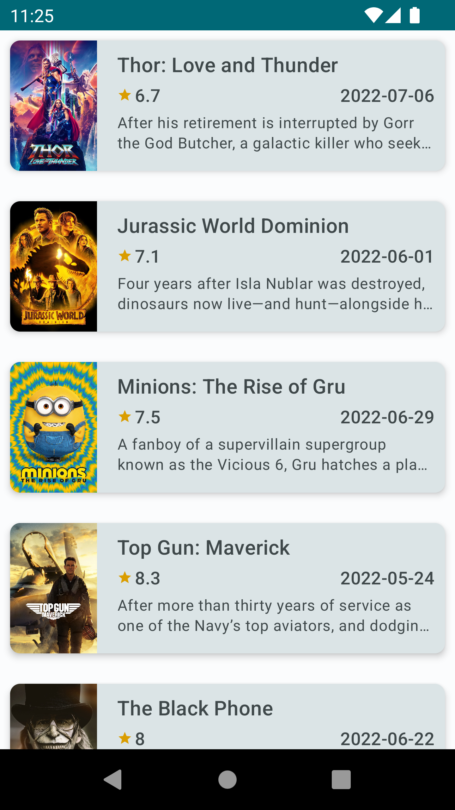
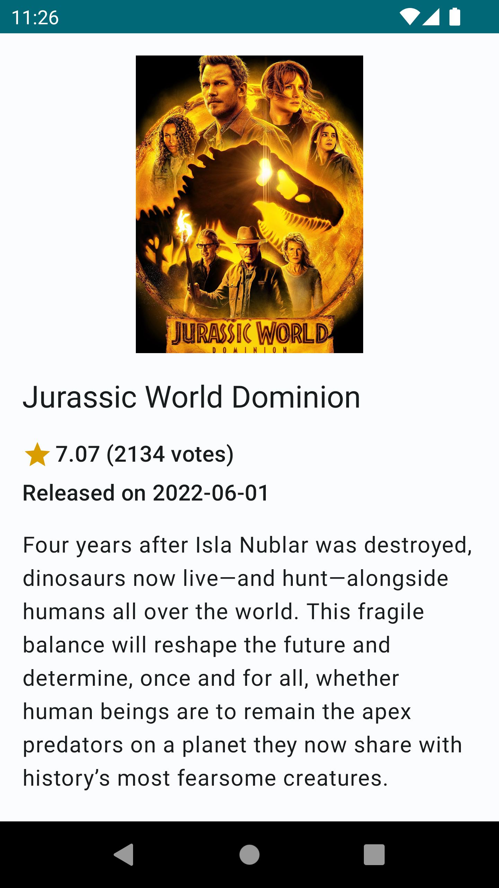

# movies-sample

A movie browsing app illustrating Android development best practices.

This sample showcases:
* Compose working in a new app: including integration with strings, resources, and themes and styles.
* Integration with a clean architecture based on MVVM and Jetpack libraries.
* Dependancy Injection with Hilt
* Network integration with retrofit/okhttp
* Tests integrating with compose and Hilt

## Screenshots

## Features
* Load a list of popular movies based on `themoviedb` API 
  * Only loading the first page of results, no option for filter/search
* Display some more details on the movie on click

Android Studio IDE setup
------------------------
For development, the latest version of Android Studio is required. The latest version can be
downloaded from [here](https://developer.android.com/studio/).

